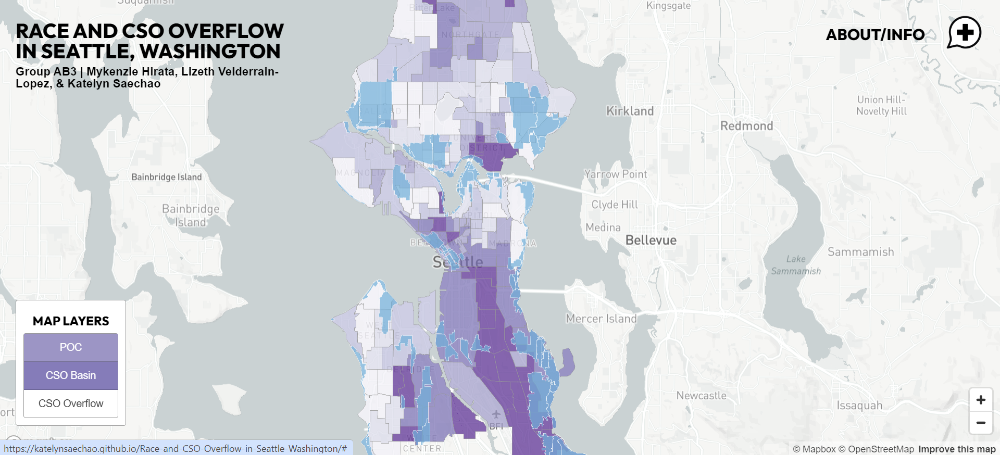
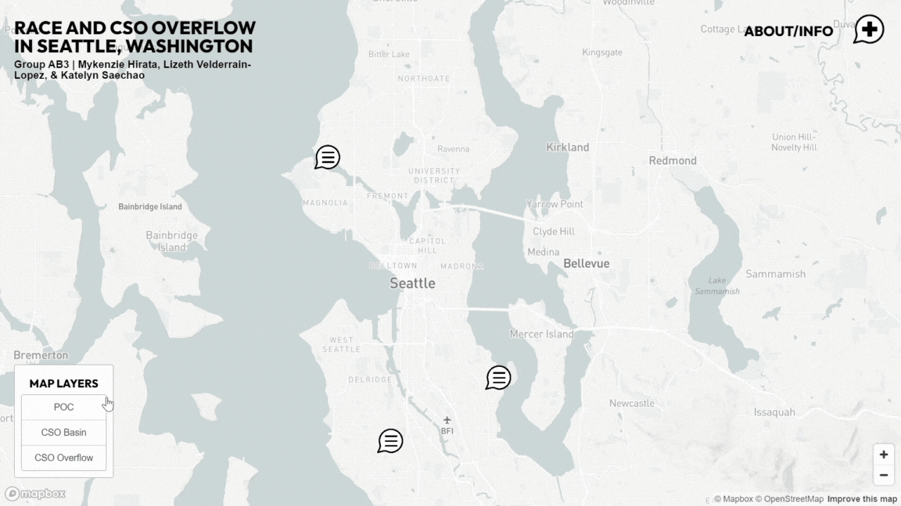
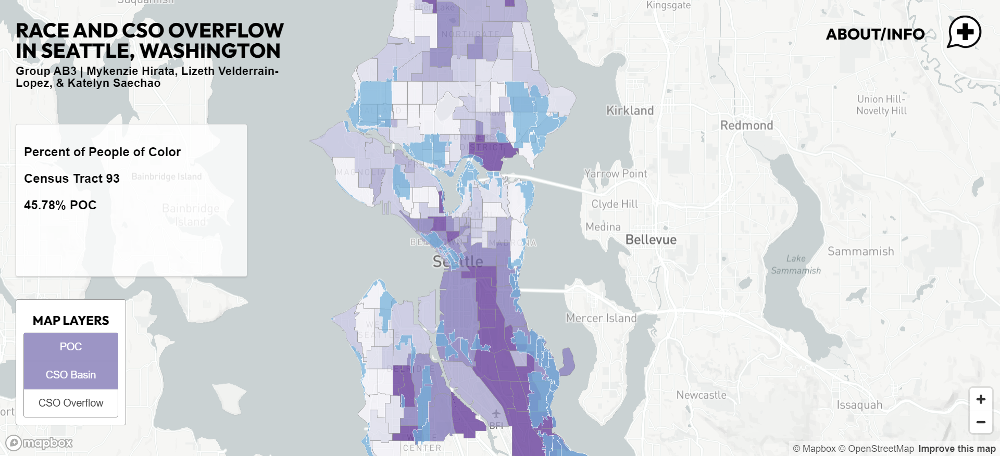
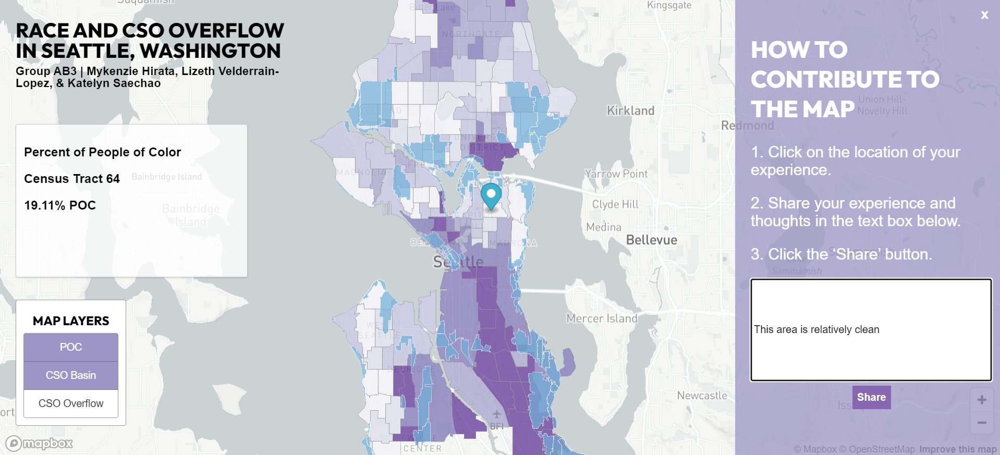

# Race and CSO Overflow in Seattle, Washington

>The map for this project can be accessed here: https://katelynsaechao.github.io/Race-and-CSO-Overflow-in-Seattle-Washington/

### Group AB3
Mykenzie Hirata, Lizeth Velderrain-Lopez, Katelyn Saechao, John Duffy, and Yu Zhimin.

# Group Contributions
The map was created by Mykenzie Hirata, Lizeth Velderrain-Lopez, Katelyn Saechao.

**Mykenzie's Contributions:**
* Helping research and gathering data
* Working on the hover function
* Making the presentation

**Lizeth's Contributions:**
* Cleaning the data sources
* Creating and coding various map layers
    * Basemap
    * POC
    * CSO Basins
    * CSO Overflow
* Creating the legend

**Katelyn's Contributions:**
* Coding various features:
    * Hovering
    * Toggling layers
    * Adding comments
* Designing the add comment button icon and the comment marker

# Description of the Project 
Utilizing the skills and mapping techniques learned in GEOG 458, we explore the relationship between demographics and environmental impacts. More specifically the spatial distribution of people of color in Seattle relationship with the annual overflow of Combined Sewer Overflow (CSO) basins.

The purpose of the map is to compare race in relation to CSO overflow volumes
within the Seattle area. This map serves as a participatory map and allows for
users to add their own comments and experiences regarding living or being near
places where CSO basins are located or places where CSO overflowing occurs.

# Map Screenshots/GIFS

### *Toggling Layers*
Screenshot

Gif

### *Hovering*
Screenshot

Gif

### *Adding Comments to the Map*
Screenshot

Gif

# Project Goals
### *Spatial Understanding*

* Develop an understanding of the spatial distribution of POC in Seattle

### *Community Awareness*

* Raise awareness within the community about the intersection of demographics and environmental challenges

### *Data Visualization*

* Effectively communicate complex demographic and environmental data through visualization

# Code Templates Used
* [Lab 3: Web Map Application](https://github.com/jakobzhao/geog458/tree/master/labs/lab03)
* [Creating Your Own Participatory Mapping Project: A Guide](https://github.com/jakobzhao/participatory-mapping)

# Data Sources
* [CSO Basins (Seattle GeoData)](https://data-seattlecitygis.opendata.arcgis.com/datasets/deb3e78249bf41b48a2f53efdb6f704f_0/explore?location=47.597238%2C-122.330350%2C12.00)
* [Race by Age Groups (B01001A-I)(Seattle GeoData)](https://data-seattlecitygis.opendata.arcgis.com/datasets/a3deea5b34d44e3baad6200db4ac8c39_0/explore)

# Citations
Combined sewer overflow status - King County, Washington, https://www.kingcounty.gov/en/dept/dnrp/waste-services/wastewater-treatment/sewer-system-services/cso-status.

Combined Sewer Overflows and Clean Water Goals: Recommendations from the Government Accountability Office to Track and Accelerate Progress, River Network. https://www.rivernetwork.org/events/combined-sewer-overflows-and-clean-water-goals-recommendations-from-the-government-accountability-office-to-track-and-accelerate-progress/.

ECOSS, 2019. Combined sewer overflow: how stormwater became Puget Sound’s #1 source of pollution. https://ecoss.org/combined-sewer-overflow-stormwater-pollution-gsi-explainer/.

Environmental Justice and Sewage Pollution in Atlanta - Emory Office of Sustainability Initiatives, 2022. https://sustainability.emory.edu/environmental-justice-and-sewage-pollution-in-atlanta/.

MyRWA Testifies on Combined Sewer Overflows, 2023. Mystic River Watershed Association.https://mysticriver.org/news/2023/11/6/myrwa-testifies-on-combined-sewer-overflows.

US EPA, O., 2023. Combined Sewer Overflow Basics. https://www.epa.gov/npdes/combined-sewer-overflow-basics.

# Applied Libraries and Web Services

### *Libraries in Use*
* Mapbox
* Maplibre

### *Web Services in Use*
* Github
* Heroku
* PGadmin
* Canva

# Additional Notes

This repositiory was forked from the original repository since Katelyn was the one who paid to host the server. To see all of the commit details and contributions made to this map, please view the original github repository here: https://github.com/mykenzieh03/GEOG_458_Final_Project

# Acknowledgement
This map was inspired by the course content in GEOG 458, taught by Professor Bo Zhao. We would like to thank Bo Zhao and Liz Peng for their feedback and guidance.
